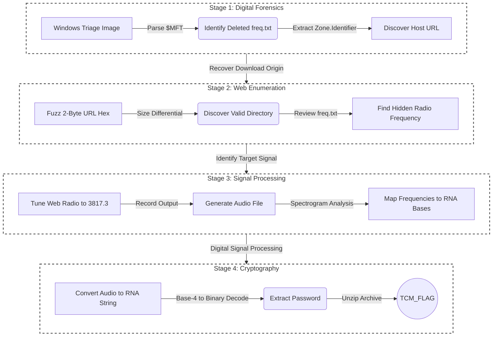

# 🔍 Project Helix

|Category         |	Author                |
|-----------------|-----------------------|
|🔍 Forensics       |The Cyber Mentor    |

## Challenge Prompt

Project Helix: CTF Scenario

Three days ago, lead geneticist Dr. Owens sent a final frantic transmission claiming he had intercepted a "biological broadcast." He described it as a repeating signal he believed to be a synthetic RNA sequence manifesting as radio frequency interference.

In violation of Protocol 4, Owens began unauthorized testing on a high-risk specimen. All communications stopped soon after. A security sweep of Owens' laboratory confirmed he is missing. His local workstation was found powered on, but all of his research has been deleted. Internal sensors indicate the "broadcast" is still active on a localized frequency, but the specific coordinates were deleted along with Owens' research notes.

You have been provided a forensic triage image of Owens' workstation. Your objective is to recover the deleted notes and identify the RNA-based key required to unlock his encrypted specimen archive.

## Problem Type
- Audio
- Forensics
- Web

## TL;DR
Project Helix is a multi-stage forensic and cryptography challenge. The scenario involves investigating the disappearance of a lead geneticist, requiring the forensic analysis of a provided Windows triage image. The attack path requires parsing the NTFS Master File Table (MFT) to recover deleted file metadata, exploiting predictable web directories to recover deleted logs, tuning a hidden web-radio interface, and utilizing Digital Signal Processing (DSP) to decode a synthetic RNA frequency broadcast into an ASCII password.

### Attack Path Visualization


## Solve
### Phase 1: Forensic Triage & The MFT

We are provided with `2026-02-25T224057_Triage.zip`, which extracts to a raw copy of a Windows `C:\` drive. Exploring the `C:\Users\drowens` directory, we find a shortcut to a file named `freq.txt` inside the `C:\users\drowens\AppData\Roaming\Microsoft\Windows\Recent` files folder.


I right-clicked to review the properties of the file:<br>


The shortcut points to `C:\users\drowens\Downloads`, but this directory is missing from the triage image, indicating the file was deleted to hide the research. To recover data about this deleted file, we must analyze the file system's index.

Using [Eric Zimmermans](https://ericzimmerman.github.io/) MFT Explorer, we load the `C:\$MFT` file and search for `freq.txt`:<br>


In NTFS file systems, the `$MFT` acts as a massive database tracking every file, including metadata for deleted files that haven't been overwritten. By inspecting the `freq.txt` record, we can view its Alternate Data Streams (ADS), specifically the `Zone.Identifier`. This is known as the "Mark of the Web" (MotW), a security feature Windows uses to track the origin URL of downloaded files.

The Zone Identifier reveals the file was downloaded from: `https://ctf.tcmsecurity.com/3c7d7997..a7/freq.txt`.

### Phase 2: Web Fuzzing & Size Differentials

The extracted URL contains two corrupted bytes `(..)`. filling in any letters will give you a website since this is a strict Single Page Application (SPA) proxy so we can use a Size Differential Attack.

Assuming the missing bytes are standard hexadecimal characters, we can write a PowerShell script to iterate from `00` to `FF`. We check the Content.Length of a known bad request and compare it against our fuzzed requests to find the outlier.


```powershell
$wrong = ((Invoke-WebRequest -UseBasicParsing -Uri "https://ctf.tcmsecurity.com/3c7d799700a7/freq.txt").Content.Length / 1KB)

0..0xFF | ForEach-Object {
$hex = "{0:x2}" -f $_
$hex = $hex + "a7"
$size = ((Invoke-WebRequest -UseBasicParsing -Uri "https://ctf.tcmsecurity.com/3c7d7997$hex/freq.txt").Content.Length / 1KB)
  if ($size -ne $wrong) {
  write-host "Found: $hex   Size: $size"
  }
}
```
The script identifies `c1a7` as the correct sequence:<br>


{: .notice--info}

><strong>Alternative method:</strong><br>
> Instead of relying on a GUI tool, we can extract this data directly from the $MFT using Linux utilities.
> We can `grep` on the part that we know is good in the MFT, `3c7d7997` using `-a` to treat the file as text, `-b` to get the byte offset, and `-o` to only print the pattern.<br>
> MFT records are exactly 1024 bytes long, so they always start at multiples of 1024. The byte offset from above is in the middle of a record, so we use floor division to give us a whole number for `212669942 // 1024`.
> Then we multiply by 1024 to find the starting byte of the MFT record to inspect, giving us `212669440`.<br>
> Now we can use `dd` to find the data. `if=` for the input file, `bs=1` to set the block size to 1 byte, `skip=212669440` to start at the boundry we calculated, `count=100` to read the first 100 bytes after, and the `| xxd` to convert the binary to a hex dump we can read.<br>
>

Navigating to the restored URL reveals the deleted `freq.txt` log, which contains a list of radio frequencies. <br>


Filtering out the standard entries using `grep -v "(X)" freq.txt` isolates a single anomaly: `3817.3`:<br>


### Phase 3: Web Radio & Spectrogram Analysis

Removing the `freq.txt` from the from the URL drops us onto a web-based radio interface with `volume`, `RF gain`, `zoom`, and `radio freq` dials.:<br>


The `radio freq` dial doesn't seem moveable to the right frequency, but if you open dev tools and then look in the console and turn the radio on there is a hint:<br>


Following the instructions, we can set the dial to `3817.3`:<br>


Then we start to hear beeps over our speakers:<br>


We need to record the beeps for about 156 seconds to get 2 full 78 second cycles (we likely started in the middle of one) to make sure we have a full start to finish cycle.

This outputs a WEBM file. I used [Cloud Convert](https://cloudconvert.com/webm-to-wav) to convert the file to a WAV file instead.:<br>


Using Python and `matplotlib`, we plot the audio file into a Spectrogram to visualize the frequencies over time.:
```python
import matplotlib.pyplot as plt
from scipy.io import wavfile

# Load the file
sample_rate, data = wavfile.read('SIG_INT_1774003543049.wav')

# If it's stereo, take one channel
if len(data.shape) > 1:
    data = data[:, 0]

# Create a Spectrogram
plt.figure(figsize=(12, 6))
plt.specgram(data, Fs=sample_rate, NFFT=1024, noverlap=512, cmap='viridis')

plt.title('Waterfall Analysis (Spectrogram)')
plt.ylabel('Frequency [Hz]')
plt.xlabel('Time [sec]')
plt.colorbar(label='Intensity [dB]')
plt.show()
```

This showed the beeps in a Spectrogram: <br>


A spectrogram (or waterfall graph) allows us to see the exact frequencies (in Hz) being broadcast. Zooming in on our graph reveals the beeps are strictly modulating between four distinct frequencies: 1000 Hz, 2000 Hz, 3000 Hz, and 4000 Hz:<br>


Cross-referencing this with the clue found in `LOG_088` in the `freq.txt` file we can map the letters to frequencies:
```
LOG_088:
It speaks in strands. A four-fold tongue. I saw it on the waterfall today. tHEY are sending a message... quaternary? every pulse is part of a base... A...C...G...U... but what is the charcode? They called me CRAZY!

If I start counting from 0 it starts to make sense.
```

So we make A=0, C=1, G=2, and U=3 or A=1000, C=2000, G=3000, and U=4000.

### Phase 4: Signal Decoding & Base-4 Translation

With the audio mapped, we utilize Python 'scipy` to slice the audio into 0.1-second chunks, identify the peak frequency in each chunk, and generate a massive string of raw RNA bases (e.g., AAAAAAAACCCCCCCCCGCCC...).
```python
import numpy as np
from scipy.io import wavfile

# 1. Load the WAV file
sample_rate, data = wavfile.read('SIG_INT_1774003543049.wav')
if len(data.shape) > 1: data = data[:, 0] # Use one channel if stereo

# 2. Define frequencies and their RNA mappings
# Based on LOG_088: A=0, C=1, G=2, U=3
freq_map = {1000: 'A', 2000: 'U', 3000: 'G', 4000: 'C'}
targets = np.array([1000, 2000, 3000, 4000])

# 3. Analyze chunks (Adjust 'chunk_size' if the output looks too fast or slow)
chunk_size = int(sample_rate * 0.1) # 0.1 seconds per pulse
sequence = []

for i in range(0, len(data), chunk_size):
    chunk = data[i:i+chunk_size]
    if len(chunk) < chunk_size: break
    
    # FFT to find the loudest frequency in this chunk
    fft_data = np.abs(np.fft.rfft(chunk))
    freqs = np.fft.rfftfreq(len(chunk), 1/sample_rate)
    
    # Find which target frequency is loudest
    peak_idx = np.argmax(fft_data)
    peak_freq = freqs[peak_idx]
    
    # Match to the closest target (1k, 2k, 3k, or 4k)
    closest_freq = targets[np.argmin(np.abs(targets - peak_freq))]
    sequence.append(freq_map[closest_freq])

# 4. Print the raw RNA string
full_string = "".join(sequence)
print(f"Detected RNA Sequence: {full_string}")
```
This gives us:
```
AAAAAAAACCCCCCCCCGCCCACUUUUUUUUUGGGGGGGGGCCCCCCCCAAAAAAAAACCCACUCUUUUUUUUUGGGGGGGGGGGGGGGGUUUUUUUUUCCACUCCUUUUUUUUUCCCCCCCCAAAAAAAAAAAAAAAAACACUCCCUUUUUUUUUCCCCCCCCCCCCCCCCAAAAAAAAAACUCCCGUUUUUUUUUCCCCCCCCCCCCCCCCAAAAAAAAACUCCCGCUUUUUUUUUUUUUUUUUAAAAAAAAGGGGGGGGGUCCCGCCUUUUUUUUUAAAAAAAACCCCCCCCGGGGGGGGGCCCGCCCUUUUUUUUUAAAAAAAAAAAAAAAAUUUUUUUUUCCGCCCCUUUUUUUUUUUUUUUUUAAAAAAAAAAAAAAAAACGCCCCUUUUUUUUUUGGGGGGGGCCCCCCCCCCCCCCCCCGCCCCUCUUUUUUUUUGGGGGGGGCCCCCCCCAAAAAAAAACCCCUCUUUUUUUUUUCCCCCCCCGGGGGGGGGUUUUUUUUCCCUCUCUUUUUUUUUGGGGGGGGCCCCCCCCCUUUUUUUUCCUCUCCGUUUUUUUUUGGGGGGGGUUUUUUUUUUUUUUUUUUCUCCGCUUUUUUUUUCCCCCCCCAAAAAAAAGGGGGGGGGCUCCGCCUUUUUUUUUGGGGGGGGAAAAAAAAUUUUUUUUUUCCGCCCUUUUUUUUUCCCCCCCCAAAAAAAACCCCCCCCCCCGCCCAUUUUUUUUUGGGGGGGGUUUUUUUUUUUUUUUUUCGCCCACUUUUUUUUUUUUUUUUUAAAAAAAACCCCCCCCCGCCCACUCUUUUUUUUGGGGGGGGCCCCCCCCCAAAAAAAACCCACUCCUUUUUUUUGGGGGGGGGGGGGGGGGUUUUUUUUCCACUCCCUUUUUUUUCCCCCCCCAAAAAAAAAAAAAAAAACACUCCCGUUUUUUUUCCCCCCCCCCCCCCCCCAAAAAAAAACUCCCGCUUUUUUUUCCCCCCCCCCCCCCCCCAAAAAAAACUCCCGCCUUUUUUUUUUUUUUUUUAAAAAAAAGGGGGGGGUCCCGCCCUUUUUUUUAAAAAAAAACCCCCCCCGGGGGGGGCCCGCCCCUUUUUUUUUAAAAAAAAAAAAAAAAUUUUUUUUUCGCCCCUUUUUUUUUUUUUUUUUUAAAAAAAAAAAAAAAAAGCCCCUCUUUUUUUUUGGGGGGGGCCCCCCCCCCCCCCCCCCCCCUCUUUUUUUUUUGGGGGGGGCCCCCCCCAAAAAAAAACCCUCUCUUUUUUUUUCCCCCCCCGGGGGGGGGCUUUUUUUUUUCUCCGCUUUUUUUUUGGGGGGGGCCCCCCCCUUUUUUUUUCUCCGCCUUUUUUUUUGGGGGGGGUUUUUUUUUUUUUUUUUUCCGCCCUUUUUUUUUCCCCCCCCAAAAAAAAGGGGGGGGGCCGCCCAUUUUUUUUUGGGGGGGGAAAAAAAAUUUUUUUUUCGCCCACUUUUUUUUUCCCCCCCCAAAAAAAAACCCCCCCCGCCCACUCUUUUUUUUGGGGGGGGUUUUUUUUUUUUUUUUUCCCACUCCUUUUUUUUUUUUUU
```

Because the beeps last for several 0.1 second chunks, the letters repeat when they shouldn't so we need to clean that up. We will round based on 0.85 seconds per beep to clean up the letters.<br>

The final hurdle is translating this synthetic RNA into an ASCII password. This requires understanding base-4 (quaternary) computing.
- There are 4 RNA bases, which can be represented by 2 bits of binary: A=00, U=01, G=10, C=11.
- A standard ASCII character is 1 byte (8 bits).
- Therefore, it takes exactly 4 RNA bases (4 bases × 2 bits) to equal 1 ASCII character.

Because we don't know if our recording started exactly at the beginning of a character byte, our script must test all 4 possible offsets to see which one perfectly aligns the binary into readable text.

```python
import re
import numpy as np
import matplotlib.pyplot as plt
from scipy.io import wavfile

# ==========================================
# 1. LOAD THE AUDIO
# ==========================================
# Replace with your actual audio file name
sample_rate, data = wavfile.read('SIG_INT_1774003543049.wav')

# If it's stereo, grab just the first channel
if len(data.shape) > 1: 
    data = data[:, 0]


print("Opening visual spectrogram window...")
print("\n==========================================")

# ==========================================
# 2. VISUALIZATION (SPECTROGRAM)
# ==========================================
plt.figure(figsize=(12, 6))
plt.specgram(data, Fs=sample_rate, NFFT=1024, noverlap=512, cmap='viridis')

plt.title('Waterfall Analysis (Spectrogram)')
plt.ylabel('Frequency [Hz]')
plt.xlabel('Time [sec]')
plt.colorbar(label='Intensity [dB]')

# Display the graph (This will pause the script until the window is closed)
plt.show()

print("Analyzing audio signal mathematically...\n")

# ==========================================
# 3. DIGITAL SIGNAL PROCESSING (DECODING)
# ==========================================
# Based on LOG_088: A=0, C=1, G=2, U=3
freq_map = {1000: 'A', 2000: 'U', 3000: 'G', 4000: 'C'}
targets = np.array([1000, 2000, 3000, 4000])

# Phase 1: FFT Slicing (0.1s chunks)
chunk_size = int(sample_rate * 0.1)  # 0.1 seconds per pulse
sequence = []

for i in range(0, len(data), chunk_size):
    chunk = data[i:i+chunk_size]
    if len(chunk) < chunk_size: 
        break
    
    # FFT to find the loudest frequency in this chunk
    fft_data = np.abs(np.fft.rfft(chunk))
    freqs = np.fft.rfftfreq(len(chunk), 1/sample_rate)
    
    # Find which target frequency is loudest
    peak_idx = np.argmax(fft_data)
    peak_freq = freqs[peak_idx]
    
    # Match to the closest target (1k, 2k, 3k, or 4k)
    closest_freq = targets[np.argmin(np.abs(targets - peak_freq))]
    sequence.append(freq_map[closest_freq])

full_string = "".join(sequence)

# Phase 2 & 3: Noise Filter & RLE Chunking
matches = re.finditer(r'(A{6,}|C{6,}|G{6,}|U{6,})', full_string)
aligned_sequence = ""

for m in matches:
    char = m.group(1)[0]
    length = len(m.group(1))
    base_count = round(length / 8.5)
    aligned_sequence += char * max(1, base_count)

# Phase 4: Decoding the 4 Offsets
mapping = {'A': '00', 'U': '01', 'G': '10', 'C': '11'}
print("--- Decoding Results ---")

for offset in range(4):
    shifted = aligned_sequence[offset:]
    result = ""
    
    for i in range(0, len(shifted) - 3, 4):
        codon = shifted[i:i+4]
        bits = "".join(mapping[b] for b in codon)
        val = int(bits, 2)
        
        # Filter for printable ASCII characters
        if 32 <= val <= 126:
            result += chr(val)
        else:
            result += "."
            
    print(f"Offset {offset}: {result}")
```

The script successfully translates the signal on the correct offset, revealing the archive password: `|RNAPolymeraseSlip|`:<br>


We use this password to decrypt the high-risk specimen archive and extract the flag.:<br>


To extract the flag!<br>


## Flag
`TCM{V01D_S1GN4L_4U7H3N71C473D}`

## Vulnerability Mapping: Common Weakness Enumerations (CWE)
| CWE ID | Vulnerability Name | Application in Challenge |
|--------|--------------------|--------------------------|
| CWE-311 | Missing Encryption of Sensitive Data | The biological broadcast transmitted the password in plaintext over an open, unencrypted radio frequency, relying solely on obscurity and data encoding (Base-4) rather than actual cryptography. |
| CWE-534 | Information Exposure Through Debug Log Files | The development/research logs left on the active server leaked the critical frequency needed to intercept the broadcast. |

