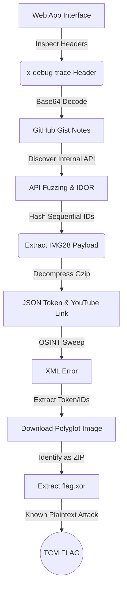

# 🌐 Operation Breadcrumbs

|Category         |	Author                |
|-----------------|-----------------------|
|🌐 Web      |The Cyber Mentor    |

## Challenge Prompt

Operation Breadcrumbs

Welcome, operator. Your flag is prepared on demand, straight from the TCM flag service.

Request your drop with the button below. When it arrives, submit it in the field underneath.

Flags follow the format TCM{...}. Good luck!

## Problem Type
- Web
- OSINT
- Cryptography

## TL;DR
Operation Breadcrumbs is a multi-stage challenge that seamlessly blends web application enumeration, Open-Source Intelligence (OSINT), and cryptography. The attack path requires identifying a strict Single Page Application (SPA) proxy, exploiting an Insecure Direct Object Reference (IDOR) on an internal API using predictable MD5 hashes, extracting cloud infrastructure details via YouTube OSINT, and defeating a JPG/ZIP polyglot file. The final stage involves mathematically reversing an Exclusive OR (XOR) cipher with infomation obtained from the metadata or using a Known Plaintext Attack (KPA) to reveal the flag.

### Atack Path Visualization


## Solve

### Phase 1: Web Enumeration & IDOR

We begin with a simple web interface featuring a `Download Flag` button. Clicking it results in a generic UI error:
```
⚠️ Something went wrong

The flag service is temporarily unavailable. Our team has been notified.
```


However, by opening the browser's Developer Tools (F12) and monitoring the Network tab, we can inspect the raw HTTP response from the `/api/flag` endpoint:
`XHR GET https://ctf.tcmsecurity.com/api/flag`


The server returns a [418 I'm a teapot](https://developer.mozilla.org/en-US/docs/Web/HTTP/Reference/Status/418) status code along with a custom header:
```HTTP
x-debug-trace: aHR0cHM6Ly9naXN0LmdpdGh1YnVzZXJjb250ZW50LmNvbS9NYWx3YXJlQ3ViZS9mYjA3NDM0YzFmYmEzYjkxNDNjYWU4ZjAxMzA5YTU3Zi9yYXcvNTk4MTRkMGY0MTU4MTMyNWJhZTVjODBiMGRlOTg0NDk2M2Q0NGI0Ny9mbGFnLXNlcnZpY2UtZGVidWctbm90ZXMubWQ=
```


Decoding this Base64 string with [CyberChef](https://gchq.github.io/CyberChef/) and using the `from Base64` recipe, reveals a URL pointing to a raw GitHub Gist containing developer debug notes:
```
https://gist.githubusercontent.com/MalwareCube/fb07434c1fba3b9143cae8f01309a57f/raw/59814d0f41581325bae5c80b0de9844963d44b47/flag-service-debug-notes.md
```


The notes complain about a "bulk import" choking and leak an internal API endpoint:
```
# upload worker - queue stalls

worker keeps choking on the bulk import. the per-item debug dump sits on the
internal api:
/api/internal/ff9d9e38a38333145e46b49aa4a5f4b6?_=1718041920473&rid=7f3c9a2b1e&debug=1

grabbed that this morning, was useful. came back after lunch and it's 404.
of course it is. this is what I get for vibe-coding the whole thing...
```

If we attempt to go to the API link, as suggested in the note, we get a 404 error.


The string `ff9d9e38a38333145e46b49aa4a5f4b6` is an MD5 hash. Checking this against a rainbow table (like [Crack Station](https://crackstation.net/)) reveals it is the hash for the string IMG27. This indicates a critical flaw: the backend uses predictable, sequentially named resources hashed with a weak algorithm:


Knowing the naming convention, we can exploit this IDOR by scripting a loop to hash `IMG1` through `IMG100` and fuzzing the API to find the stalled queue item.
```bash
for i in $(seq 1 100); do hash=$(echo -n "IMG$i" | md5sum | cut -d' ' -f1); echo "IMG$i ($hash): "; curl -s "https://ctf.tcmsecurity.com/api/internal/$hash"; echo ""; sleep 1; done
```

This successfully uncovers a hit on `IMG28`, returning a JSON object containing a Gzip-compressed `auth_payload`:
```json
IMG28 (ce148ab4b8a20f6d0005775ad6320ceb): 
{"auth_payload":"H4sIAAAAAAAA/wTA7wqCMBAA8He5z6kthUiISiEiUIJGfz6JXtOGbRd6wzR6935fuHkyzTxJrbIQQ/05hdGlwcRMeXFY7cXiuJRVc72bfI6ijZKIREJTCDN46Z61bSCGJ/O7j4NgGAZ/JMeuUj6SCbYyzc4KXad53GH5UGbc9K4qkGytO1OyJrsW8PsHAAD//71EzlGFAAAA","service":"image-processor","status":"ok"}
```

Decompressing this payload with [CyberChef](https://gchq.github.io/CyberChef/) and using the  `From Base64` and `Gunzip` recipies, gives us our primary cryptography token and our OSINT breadcrumb, a YouTube link:
```json
{"X-TCM-Token":"fxP34VgcBmzN_H9F12J7TbgWYmN0c1k4B4o1Boz3","listing":"https://www.youtube.com/@TCMSecurityAcademy?sub_confirmation=1"}
```


### Phase 2: OSINT & Polyglot Extraction

Visiting the TCM Security [YouTube](https://www.youtube.com/@TCMSecurityAcademy) channel and checking the header links reveals a custom link titled `BREADCRUMB`:<br>


Visiting the URL ([https://ctf.tcmsecurity.com/tcm-prod-media/4ee5f8ff6d6a23deb9d829479b54c8e3.jpg](https://ctf.tcmsecurity.com/tcm-prod-media/4ee5f8ff6d6a23deb9d829479b54c8e3.jpg)) directly throws an XML AccessDenied error, which leaks a `RequestId` and a `HostId`:
```xml
<Error>
<Code>AccessDenied</Code>
<Message>Access Denied</Message>
<RequestId>9F3A2C1D7E4B8A60</RequestId>
<HostId>
Uf3pK2mWqL8xY1nZ7bV4tR6sD0gH5jC9aE2oP1iM3kS8wB7vN4xQ6lT0yU2rA1c=
</HostId>
</Error>
```


By using `curl` and passing our extracted token in the `X-TCM-Token` header, we successfully download the image.:
```sh
curl https://ctf.tcmsecurity.com/tcm-prod-media/4ee5f8ff6d6a23deb9d829479b54c8e3.jpg \
  -H "X-TCM-Token: fxP34VgcBmzN_H9F12J7TbgWYmN0c1k4B4o1Boz3" -o image.jpg
  % Total    % Received % Xferd  Average Speed  Time    Time    Time   Current
                                 Dload  Upload  Total   Spent   Left   Speed
100 627.4k   0 627.4k   0      0 650.0k      0                              0
```

While the image visually displays a cluster of leaves:


I ran `exiftool` against it and found it had coordinates in the output:
```sh
GPS Latitude                    : 34 deg 8' 2.76" N
GPS Longitude                   : 118 deg 19' 17.40" W
GPS Position                    : 34 deg 8' 2.76" N, 118 deg 19' 17.40" W
```

I put this location into [CalTopo](https://www.caltopo.com) and saw it was in Hollywood, CA:<br>


Attackers and CTF creators frequently use steganography or polyglot files—files that are valid in multiple formats simultaneously—to bypass naive file-upload filters. The `file` command doesn't look at the `.jpg` extension; it reads the file's "magic bytes" (the raw hex signature at the beginning of the file) to determine its true nature.:<br>
```sh
file image.jpg        
image.jpg: Zip archive, with extra data prepended
```

Renaming the file to `.zip` and extracting it drops our final challenge: `flag.xor`:
```sh
mv image.jpg image.zip 

unzip image.zip                                                         
Archive:  image.zip
warning [image.zip]:  642481 extra bytes at beginning or within zipfile
  (attempting to process anyway)
  inflating: flag.xor
```

### Phase 3: Cryptography

The `.xor` extension explicitly tells us the encryption method. Since the file is only 26 bytes long, it is not an image or archive; it is the raw ciphertext of the flag itself.

Back to CyberChef and I added the `flag.xor` file and then used the XOR operation with the key `HOLLYWOOD` to reveal the flag: <br>


<br>


## Alternative Solve

While we could brute-force the XOR operation using the variables we collected (the IDs, the Token, etc.), XOR encryption possesses a unique mathematical property that allows us to bypass guessing entirely: it is perfectly reversible.

If Ciphertext ⊕ Key = Plaintext, then it must also be true that Ciphertext ⊕ Plaintext = Key.

Because we know the standard format for this CTF is `TCM{...}`, we already possess the first four bytes of the Plaintext. We can write a Python script to perform a Known Plaintext Attack (KPA) by XORing the encrypted file against the string `TCM{`.

```python
with open('flag.xor', 'rb') as f:
    ciphertext = f.read()

known_plaintext = b"TCM{"
key_prefix = bytearray()

for i in range(len(known_plaintext)):
    key_prefix.append(ciphertext[i] ^ known_plaintext[i])

print(f"[*] The first 4 characters of the key are: {key_prefix}")
```

The script spits out the first four bytes of the author's Key: `HOLL`.

 Then we can use the [Webster's Dictionary](https://www.merriam-webster.com/wordfinder/classic/begins/all/-1/holl/1) to find words that start with `HOLL`. We could also use a file like `rockyou.txt` to do this too. We pick some words in that list that we think might be the key:
```python
with open('flag.xor', 'rb') as f:
    ciphertext = f.read()

key = b"HOLL"
decrypted = bytearray([ciphertext[i] ^ key[i % len(key)] for i in range(len(ciphertext))])
print(f"[*] Testing exact 4-byte key 'HOLL': {decrypted}\n")

key = b"HOLLY"
decrypted = bytearray([ciphertext[i] ^ key[i % len(key)] for i in range(len(ciphertext))])
print(f"[*] Testing exact 4-byte key 'HOLL': {decrypted}\n")

key = b"HOLLYWOOD"
decrypted = bytearray([ciphertext[i] ^ key[i % len(key)] for i in range(len(ciphertext))])
print(f"[*] Testing exact 4-byte key 'HOLL': {decrypted}\n")

key = b"HOLLAND"
decrypted = bytearray([ciphertext[i] ^ key[i % len(key)] for i in range(len(ciphertext))])
print(f"[*] Testing exact 4-byte key 'HOLL': {decrypted}\n")

key = b"HOLLOW"
decrypted = bytearray([ciphertext[i] ^ key[i % len(key)] for i in range(len(ciphertext))])
print(f"[*] Testing exact 4-byte key 'HOLL': {decrypted}\n")
```

## Flag
`TCM{WH3R3_DR34M5_ARE_M4D3}`

## Vulnerability Mapping: Common Weakness Enumerations (CWE)

| CWE ID | Vulnerability Name | Application in Challenge |
|--------|--------------------|--------------------------|
|CWE-639 | Authorization Bypass Through User-Controlled Key (IDOR) | The internal API allowed unauthorized access to processing payloads simply by requesting the associated hash, failing to verify user ownership of the resource. |
| CWE-330 | Use of Insufficiently Random Values | The application used sequential, predictable strings (`IMG27`, `IMG28`, etc.) as the basis for the MD5 hashes, making the IDOR vulnerability trivially enumeratable. |
| CWE-200 | Exposure of Sensitive Information to an Unauthorized Actor | The `x-debug-trace` HTTP response header inadvertently leaked internal developer notes and private API endpoint paths to the public. |
| CWE-327 | Use of a Broken or Risky Cryptographic Algorithm | Relying on a simple repeating-key XOR cipher to protect sensitive data allowed for a complete cryptographic bypass using a Known Plaintext Attack (KPA). |
| CWE-436 | Interpretation Conflict | The infrastructure hosted and served a polyglot file (a ZIP archive disguised as a JPEG), demonstrating a lack of strict magic-byte validation on file handlers. |
